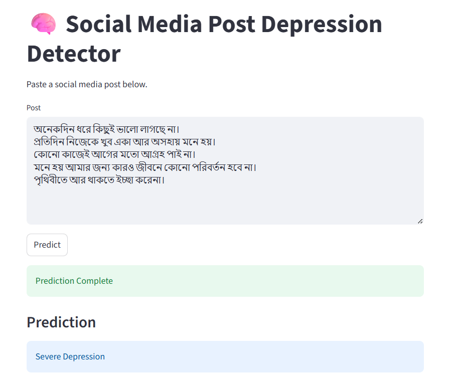
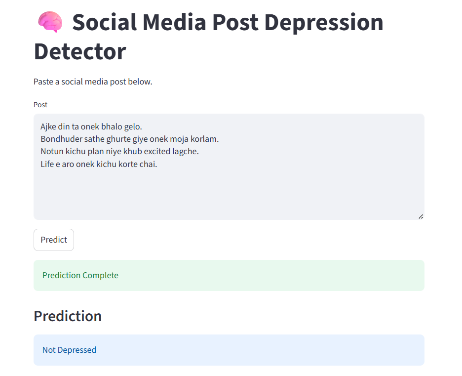
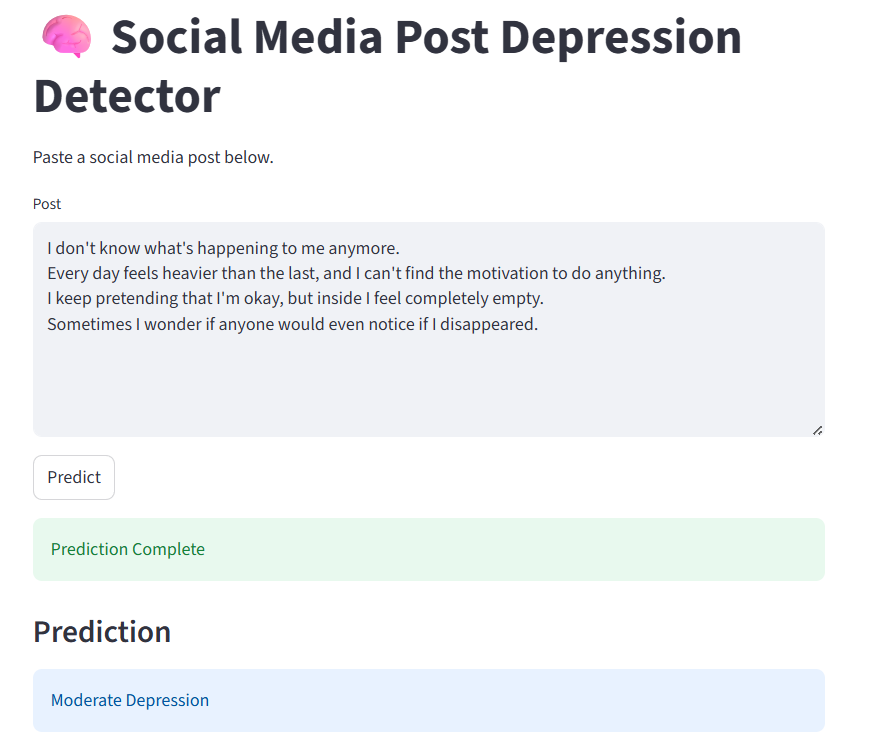
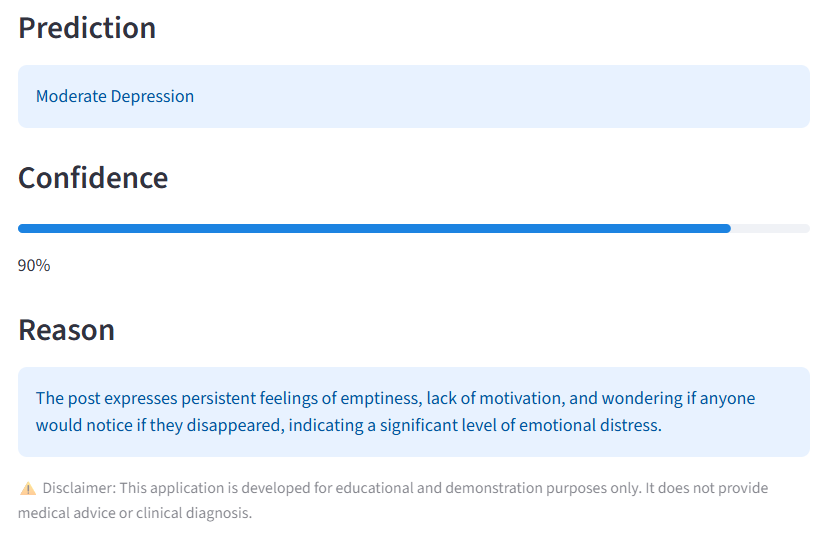

# 🧠 Multilingual Social Media Post Depression Detection

A lightweight web application developed using **Streamlit** that analyzes social media posts through **Groq's inference API** using the **Llama 3.3 70B Versatile** large language model.

The application supports **English**, **Bangla (বাংলা)**, and basic **Banglish (Romanized Bangla)** input, classifying each post into one of four depression levels while providing a confidence score and a brief explanation.

> **Disclaimer:** This project is intended for educational and demonstration purposes only. The generated predictions should not be considered a medical or clinical diagnosis.

---

## Features

- Supports **English**, **Bangla (বাংলা)**, and **Banglish** posts.
- Four prediction levels:
  - Not Depressed
  - Mild Depression
  - Moderate Depression
  - Severe Depression
- Confidence score for each prediction.
- Short explanation for the predicted class.
- Clean and interactive Streamlit interface.

---

## Screenshots

### Home


---

### Prediction Example 1



---

### Prediction Example 2



---

### Prediction Example 3

| Top | Bottom |
|:---:|:------:|
|  |  |

---

## Project Structure

```text
Social-Media-Depression-Detection/
│
├── assets/
│   ├── home.png
│   ├── prediction1.png
│   ├── prediction2.png
│   ├── prediction3_top.png
│   └── prediction3_bottom.png
│
├── app.py
├── predictor.py
├── prompt.py
├── requirements.txt
├── .gitignore
└── README.md
```

---

## Installation

Clone the repository:

```bash
git clone <repository-url>
cd Social-Media-Depression-Detection
```

Install the required packages:

```bash
pip install -r requirements.txt
```

Create a `.env` file in the project directory:

```env
GROQ_API_KEY=your_groq_api_key
```

Run the application:

```bash
streamlit run app.py
```

---

## Tech Stack

- Python
- Streamlit
- Groq API
- Llama 3.3 70B Versatile
- python-dotenv

---

## Future Improvements

- Improve Banglish language understanding.
- Compare Llama-based predictions with a fine-tuned BERT classifier.
- Evaluate the system on a labeled multilingual dataset.
- Add prediction history and visualization.
